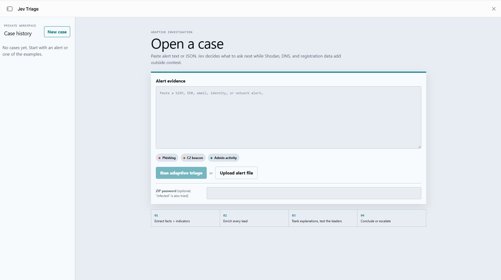
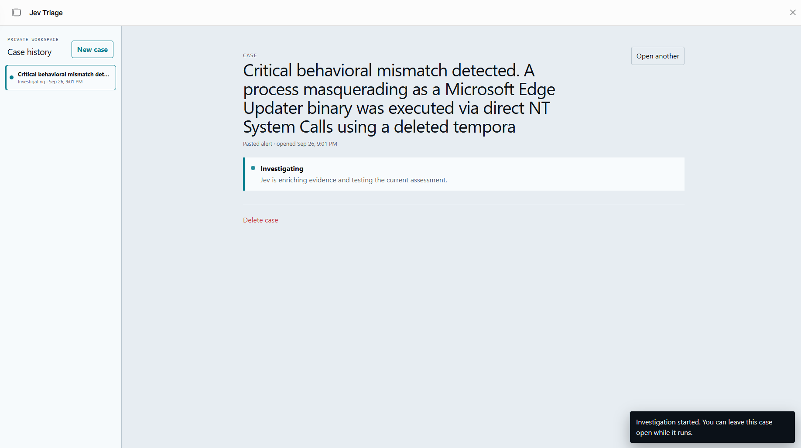
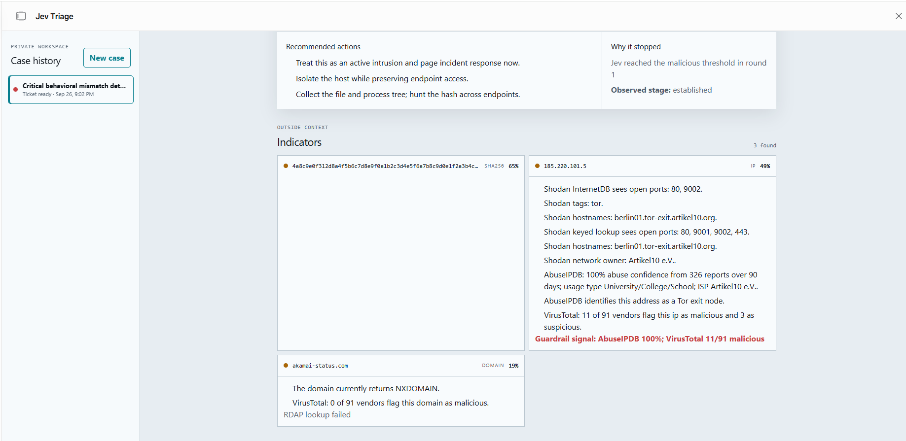
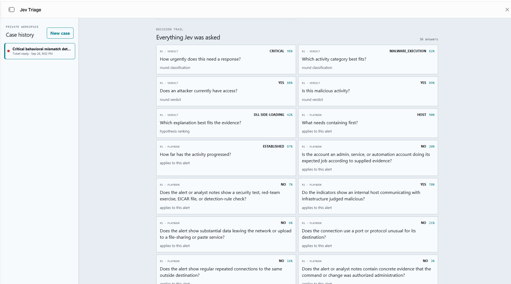
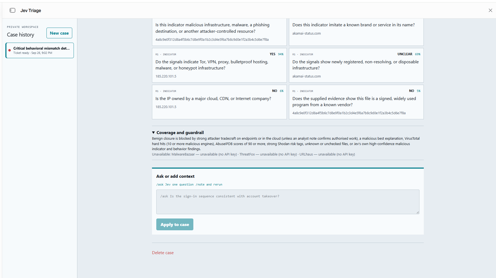

# Jev Triage

**An adaptive investigation agent for security alerts.** Paste or upload an alert and Jev Triage
works the case the way an analyst would. It pulls out the indicators, enriches them, weighs
competing explanations and keeps asking targeted questions. It stops when it can give a verdict,
a confidence level and next steps you can act on.

Every call is made by [Jev](https://www.typesafe.ai), TypeSafe's decision model. The app judges
**behaviour, not just reputation**, and every answer is shown so you can see how it got there.


## Highlights

- **Adaptive questioning.** What Jev asks next depends on the alert type, what the lookups
  return and what it has already answered.
- **Behaviour analysis.** About 45 Windows LOLBin abuse patterns, 33 Linux/macOS rules,
  parent→child process checks, masquerading detection and PowerShell `-enc` decoding. These run
  as local code with no network calls.
- **Cloud and identity coverage.** Reads CloudTrail, Azure Activity, Entra audit/sign-in, M365
  unified audit, GCP audit, Okta System Log and Kubernetes audit events, using 40 tradecraft
  rules mapped to MITRE ATT&CK.
- **Competing hypotheses.** Jev ranks 37 candidate explanations (26 malicious, 11 benign) and
  tests the leading ones each round.
- **Guardrails.** Hard threat-intel hits and strong attacker tradecraft block a benign closure.
- **Full decision trail.** The ticket lists every question, answer and probability.
- **Analyst in the loop.** Use `/ask` to put your own question to Jev, or `/note` to add context
  and re-run the case.
- **Optional Claude second opinion.** On cases Jev can't settle, Claude adds an advisory review.
  It never overrides the verdict.

## How it works

```
alert ─► extract ─► enrich ─► analyse ─► hypothesis loop ─► verdict
         IOCs,      VT,       LOLBins,   Jev ranks and        malicious / benign /
         facts,     AbuseIPDB, cloud     tests explanations   needs analyst
         events     Shodan,   rules      (up to 3 rounds)     + next actions
                    DNS, RDAP
```

1. **Extract** the indicators (IPs, domains, URLs, hashes, emails), facts, command lines and
   cloud/identity audit events from the alert.
2. **Enrich** them with VirusTotal, AbuseIPDB and Shodan, plus the keyless lookups:
   DNS-over-HTTPS, RDAP domain age and Shodan InternetDB.
3. **Analyse behaviour** with the endpoint rules in `behavior.ts` and the cloud rules in `cloud.ts`.
4. **Run the hypothesis loop** in `hypotheses.ts`. Jev ranks the explanations and answers
   yes / no / not stated tests for the leaders. The loop stops at a confidence threshold, after
   3 rounds, or when there is nothing new to ask.
5. **Record the verdict** with `decidedBy` attribution. Cases Jev can't settle go to
   **needs analyst**.
6. **Get a second opinion (optional).** Claude reviews "needs analyst" cases in the background.
   To change this, set `CLAUDE_MODE` in `server/src/actions.ts` to `"second_opinion"` (the
   default), `"tiebreak"` or `"off"`.

## Screenshots

| | |
|---|---|
| **Open a case**: paste alert text or JSON, try an example, or upload a file (password-protected ZIPs supported) | **Investigating**: the case runs in the background while Jev gathers evidence |
|  |  |
| **Indicators**: outside context for each indicator, with guardrail signals | **Decision trail**: every question Jev was asked, with its answer and confidence |
|  |  |
| **Coverage and follow-up**: source coverage, the benign-closure guardrail and `/ask` / `/note` | |
|  | |

## Getting started

```bash
bun install
bun run typecheck
bun run build
```

This project was built as a hosted TypeScript web app (see `AGENTS.md` and `space.json`). To run it
on another host, you need to change two things:

1. **Runtime SDK.** `@hatch/space-sdk` is a local file dependency in `package.json`. Replace it
   with your host's runtime, or stub the small part of it that the server uses.
2. **Credentials.** At request time, the server takes API keys from named vault entries. To run it
   elsewhere, supply these values where `server/src/privileged.ts` references the `custom.*`
   names:

   | Entry | Service | Sent as |
   |---|---|---|
   | `custom.virustotal` | VirusTotal | `x-apikey` header |
   | `custom.abuseipdb` | AbuseIPDB | `Key` header |
   | `custom.shodan` | Shodan | query parameter |
   | `custom.anthropic` | Anthropic (optional) | `x-api-key` header |

   You also need access to the TypeSafe Jev model (`jev-latest`). Without it, only the behaviour
   and cloud analysers run.

For the thresholds, number of rounds and rate limits, see `spec/.env.example`.

## Project layout

```
server/src/
  triage.ts        triage engine
  behavior.ts      endpoint behaviour analyser
  cloud.ts         cloud / identity audit reader
  hypotheses.ts    candidate explanations and tests
  claude.ts        optional Claude second opinion
  privileged.ts    enrichment lookups and subprocesses
  actions.ts       server actions
  schema.ts        database schema
client/src/        React ticket UI
drizzle/           SQL migrations
docs/screenshots/  README images
spec/              original spec: Python reference implementation, GitHub Actions
                   workflow, question library, samples and tests
```

### Python reference implementation

`spec/` has a standalone Python version that runs on GitHub Actions: open an issue with an alert
and it posts the report as a comment. It can also run as a small FastAPI service. For setup, see
[`spec/README.md`](spec/README.md).

```bash
cd spec
pip install -r requirements.txt pytest pytest-asyncio
pytest
```

## License

[MIT](LICENSE)
