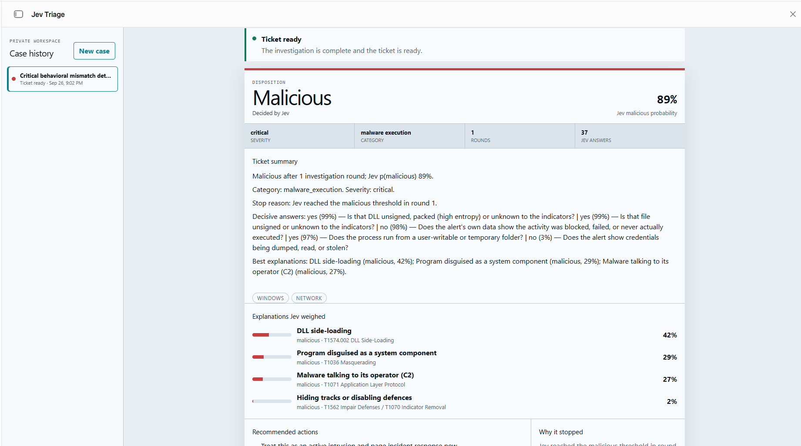

# Jev Triage

**An adaptive investigation agent for security alerts.** Paste or upload an alert and Jev Triage
works the case the way an analyst would. It pulls out the indicators, enriches them, weighs
competing explanations and keeps asking targeted questions. It stops when it can give a verdict,
a confidence level and next steps you can act on.

Every call is made by [Jev](https://www.typesafe.ai), TypeSafe's decision model. The app judges
**behaviour, not just reputation**, and every answer is shown so you can see how it got there.

It runs anywhere Bun or Docker runs: your laptop, a VM or a container platform. The only
required key is for Jev.



## Quick start

**With Bun** ([install Bun](https://bun.sh) 1.2 or newer):

```bash
cp .env.example .env      # add TYPESAFE_API_KEY (and optionally VirusTotal, Shodan, AbuseIPDB, Anthropic)
bun install
bun run start             # → http://localhost:3000
```

**With Docker:**

```bash
cp .env.example .env      # add your keys
docker compose up -d      # → http://localhost:3000
```

The database is stored in `./data` (Bun) or the `jev-triage-data` volume (Docker).

## Highlights

- **Adaptive questioning.** What Jev asks next depends on the alert type, what the lookups
  return and what it has already answered.
- **Behaviour analysis.** About 45 Windows LOLBin abuse patterns, 33 Linux/macOS rules,
  parent→child process checks, masquerading detection and PowerShell `-enc` decoding. These run
  as local code with no network calls.
- **Cloud and identity coverage.** Reads CloudTrail, Azure Activity, Entra audit/sign-in, M365
  unified audit, GCP audit, Okta System Log and Kubernetes audit events, using 40 tradecraft
  rules mapped to MITRE ATT&CK.
- **Competing hypotheses.** Jev ranks 37 candidate explanations (26 malicious, 11 benign) and
  tests the leading ones each round.
- **Guardrails.** Hard threat-intel hits and strong attacker tradecraft block a benign closure.
- **Full decision trail.** The ticket lists every question, answer and probability.
- **Analyst in the loop.** Use `/ask` to put your own question to Jev, or `/note` to add context
  and re-run the case.
- **Looks at the surrounding logs, like an analyst.** Around each alert the agent searches your
  EDR, SIEM or XDR: what else ran on the host, the process tree, the account's sign-ins, and where
  else a file, IP or domain was seen. It works with CrowdStrike, Splunk, Google SecOps, Elastic,
  Microsoft Defender and Trend Vision One. Jev decides which further searches are worth running.
- **Starts when an alert arrives.** Your SIEM, XDR or EDR posts alerts to a webhook, and triage
  begins at once. You can also paste or upload alerts by hand.
- **Hot, warm and cold loops.** Jev settles each alert in seconds (hot). In the background, related
  cases and a second AI catch what one alert can't show (warm). Offline, labelled cases and approved
  memory make the agent more accurate over time (cold). See [below](#hot-warm-and-cold-loops).
- **Any model as the reviewer AI.** Claude, OpenAI, Gemini, Azure OpenAI, OpenRouter, or a local
  model through Ollama. It's optional, and it never overrides Jev's verdict.

## How it works

```
alert ─► extract ─► enrich ─► analyse ─► hypothesis loop ─► verdict
         IOCs,      VT,       LOLBins,   Jev ranks and        malicious / benign /
         facts,     AbuseIPDB, cloud     tests explanations   needs analyst
         events     Shodan,   rules      (up to 3 rounds)     + next actions
                    DNS, RDAP
```

1. **Extract** the indicators (IPs, domains, URLs, hashes, emails), facts, command lines and
   cloud/identity audit events from the alert.
2. **Enrich** them with VirusTotal, AbuseIPDB and Shodan, plus the keyless lookups:
   DNS-over-HTTPS, RDAP domain age and Shodan InternetDB.
3. **Analyse behaviour** with the endpoint rules in `behavior.ts` and the cloud rules in `cloud.ts`.
4. **Run the hypothesis loop** in `hypotheses.ts`. Jev ranks the explanations and answers
   yes / no / not stated tests for the leaders. The loop stops at a confidence threshold, after
   3 rounds, or when there is nothing new to ask.
5. **Record the verdict** with `decidedBy` attribution. Cases Jev can't settle go to
   **needs analyst**.
6. **Keep working in the background (warm loop).** The warm loop flags related auto-closed cases,
   and the reviewer AI audits risky benign closures and gives second opinions on "needs analyst"
   cases. None of it delays or changes the verdict.

Investigations run in a background job queue stored in the database, so the page stays responsive
and a restart doesn't lose queued work.

## Hot, warm and cold loops

| Loop | Speed | Who works | What it does |
|---|---|---|---|
| **Hot** | seconds, every alert | Jev only | Triage, the guardrail, approved memory, and **related recent cases**: the agent sees what happened on the same host, account or indicator in the last 14 days. Each ticket shows how long the hot loop took. |
| **Warm** | minutes, in the background | Code, plus the reviewer AI on a small subset | **Retro-flags**: when an analyst confirms a case malicious, recent auto-closed cases that share a host, account or indicator are marked **Recheck**. The same happens, as an unconfirmed flag, when the agent calls a case malicious. **AI audit**: the reviewer AI rechecks the riskiest benign closures and a small random sample; if it disagrees, the case is marked **Recheck**. **Second opinion** on cases Jev couldn't settle. |
| **Cold** | days, offline | Reviewer AI + a person | Analyst decisions → `bun run eval` → `bun run review` → `bun run memory approve` (below). |

Rules that keep the loops fast and safe:

- **The verdict is Jev's.** The warm loop never delays or changes a verdict; it only adds flags.
- **Only confirmed history.** Related-case context includes analyst decisions, cases the agent called
  malicious (labelled unconfirmed) and open cases. It never includes the agent's own benign closures,
  so the agent can't reinforce its own mistakes.
- **A confirmed incident blocks a benign close.** If a related case was confirmed malicious, a new
  alert can't close as benign until an analyst adds a `/note`.
- **Flags clear on decision.** Recording a decision on a flagged case clears its flags. Marking the
  source case benign withdraws the flags it raised on other cases.
- **Audits are capped.** At most `AI_AUDIT_DAILY_MAX` a day (50 by default). With no reviewer AI,
  the warm loop is code only and costs nothing.

Flagged cases appear at the top of the case list under **Recheck**, so they're the first ones an
analyst decides, and those decisions feed the cold loop.

### Surrounding logs

Configure one or more log sources in `.env` and the agent searches them around each alert, the way an
analyst pivots from an alert into the logs:

| Search | What it looks for | Runs |
|---|---|---|
| Host activity | What ran and connected on the host, 30 min either side of the alert | at once |
| Process tree | What started the alerted program and what it started | at once |
| Account activity | The account's sign-ins and activity in the 24 hours before | when Jev picks it |
| File / IP / domain prevalence | Which other hosts ran the file, or talked to the IP or domain, in the last 7 days | when Jev picks it |

- **Speed:** the opening searches run while the indicators are being enriched, so they add little time.
  Each round, Jev chooses the next search, or a lookup of a new IP, domain or file the logs turned up,
  the same way it already chooses which indicator to look up next.
- **Summaries, not raw logs:** code summarises the results into short findings (what ran, where it
  connected, sign-in counts, how many hosts). Jev sees them with two extra questions: do the logs
  show follow-on attacker activity, and is this routine here? The ticket shows each search with its
  findings.

| Source | API | Credentials |
|---|---|---|
| CrowdStrike Falcon | Next-Gen SIEM event search (CQL query jobs) | API client with NGSIEM read + write |
| Splunk | REST `search/v2/jobs/export` (SPL, CIM fields) | Authentication token |
| Google SecOps | Chronicle API `udmSearch` (UDM) | Service account with `chronicle.events.udmSearch` |
| Elastic | `_search` with the Query DSL (ECS fields) | API key with `read` |
| Microsoft Defender XDR | Graph `runHuntingQuery` (KQL) | App with `ThreatHunting.Read.All` |
| Trend Vision One | Search API v3.0 `endpointActivities` | API key with XDR Data Explorer search |

- **Several sources:** they're searched in parallel and the results merged. One failing source doesn't
  stop the others; the ticket shows what failed.
- **Safe queries:** values from an alert (host, account, program, hash, IP, domain) must match strict
  patterns: no quotes, pipes, brackets, wildcards or spaces. They're also escaped for each query
  language, so an attacker-written alert can't change a search.
- **Read-only access:** use read-only credentials.
- **Evaluation:** `bun run eval --with-logs` includes log search in the score.

### Alerts in: the webhook

Set `INGEST_TOKEN`, then have your SIEM, XDR or EDR send each alert to the webhook. Any JSON or
text body is accepted, as it comes from the tool:

```bash
curl -X POST https://triage.corp.example/ingest/alert \
  -H "Authorization: Bearer $INGEST_TOKEN" \
  -H "X-Alert-Source: Vision One" \
  -H "Idempotency-Key: WB-20260928-00042" \
  --data-binary @alert.json
```

The case opens and triage starts immediately (`202` with the case id). If the same alert is sent
again within 7 days (same `Idempotency-Key`, or the same body when no key is sent), you get the
existing case back (`200`, `"duplicate": true`). The token is separate from the UI login, so the
sender never holds analyst credentials.

### Getting more accurate (the cold loop)

Triage is fast because Jev makes every call. The reviewer AI never sits on that path. It works
between runs, on cases the agent got wrong, and nothing it suggests is used until a person
approves it.

```
 analysts record         bun run eval            bun run review          bun run memory approve
 the right answer  ──►   score the agent   ──►   the AI proposes   ──►   a person applies the
 on each ticket          on labelled cases       fixes for misses        ones they agree with
        ▲                                                                          │
        └──────────── next alerts are triaged with the approved memory ◄───────────┘
```

**1. Record decisions.** At the bottom of each ticket, mark the case **Malicious** or **Benign**,
with a reason ("approved patch push, CHG-44213"). You can change it later. Every decided case
becomes a labelled case for evaluation.

**2. Evaluate.**

```bash
bun run eval                    # eval/cases/*.json + every decided ticket
bun run eval --no-memory        # the same, without memory: shows what memory adds
bun run eval --stand-in         # no keys or network: checks the setup, not real accuracy
```

The report (`eval/reports/`) gives accuracy, **malicious cases called benign** (the number that
matters most), false alarms, cases sent to an analyst, the share closed without a person, time per
case and Jev requests per case. It also lists each case the agent didn't get right. Each case runs
the way a new alert does: Jev only, no analyst notes. Lookups are recorded the first time and
replayed after that (`eval/lookup-cache.json`), so the score moves only when the agent changes.
Use `--max-missed 0` in CI to fail a build that lets a malicious case through.

`eval/cases/edr-sample.json` has 26 invented alerts to start with. Your own decided tickets
are the cases that count. See [`eval/cases/README.md`](eval/cases/README.md) for the format.

**3. Review with the reviewer AI** (needs `AI_API_KEY` or a local model).

```bash
bun run review                  # reads the latest report and writes memory/proposals/review-<time>.yaml
```

For each miss (missed malicious cases first), the reviewer AI diagnoses what went wrong and can propose four
kinds of fix:

- a line of **organisation context**, such as "svc_patching is the patch automation account";
- **wording** for what "yes" and "no" mean on a question;
- a **lesson** for the team's log;
- a **developer note** when the fix needs code.

Checks in code set a proposal aside when:

- it doesn't match the case it came from;
- it would make a malicious case look normal;
- it describes as normal an indicator the case found malicious;
- it's too broad: an IP range wider than /16, a built-in tool such as `powershell.exe`, or a whole
  detection name.

**4. Try, then approve.**

```bash
bun run memory                                           # memory in use and pending proposals
bun run memory show review-<time>.yaml                   # each proposal with the AI's reasoning
bun run eval --try memory/proposals/review-<time>.yaml p1 p2   # which cases would be fixed, or made worse
bun run memory approve review-<time>.yaml p1 p2          # add to memory, recording who, when and which case
bun run memory reject review-<time>.yaml p3 --reason "..."
```

Read each proposal before approving it: the AI saw the alert text, which an attacker can control.
Approved items are appended to the files below, and the running app picks them up on its next case.
No restart is needed.

**What memory holds** (`memory/`, plain YAML you can also edit by hand and keep in Git):

| File | Used how |
|---|---|
| `context.yaml` | Organisation context: accounts, hosts, IPs and ranges, domains, hashes, tools and detections, each with one sentence, who added it, when, and an optional expiry. Only entries that match the case are sent to Jev, in their own field labelled as your team's context (at most 12; matching 5,000 entries takes about 3 ms). |
| `question-criteria.yaml` | What "yes" and "no" mean for specific yes/no questions, sent to Jev with the question. |
| `lessons.md` | A log for people. The engine doesn't read it. |

Memory explains activity; it never clears the guardrail. Strong attacker tradecraft or a hard
threat-intel hit still needs an analyst's `/note` to close as benign. With an empty memory folder,
the engine sends Jev exactly the same requests as before. `bun run memory check` validates the
folder (for CI). An invalid edit is reported, and the app keeps using the last version that loaded.

## Configuration

All settings are environment variables, usually in `.env` (Bun loads it automatically). See
[`.env.example`](.env.example) for a commented template.

| Variable | Default | Purpose |
|---|---|---|
| `TYPESAFE_API_KEY` | — | **Required.** Jev makes every decision. |
| `JEV_MODEL` | `jev-latest` | Pin a Jev version once you're happy with its results. |
| `VIRUSTOTAL_API_KEY` | — | File, URL, domain and IP reputation. Strongly recommended: without it, files and URLs can't be checked, so the guardrail keeps them from closing as benign. |
| `SHODAN_API_KEY` | — | Host details for IPs and domains. The free Shodan InternetDB is always used for IPs. |
| `ABUSEIPDB_API_KEY` | — | IP abuse reports. |
| `AI_PROVIDER` | `anthropic` | The reviewer AI's API: `anthropic`, or `openai` for any OpenAI-compatible API (OpenAI, Azure OpenAI, Gemini, OpenRouter, Mistral, Groq, Ollama, vLLM, LM Studio). |
| `AI_API_KEY` | — | The reviewer AI's key (`ANTHROPIC_API_KEY` / `OPENAI_API_KEY` also work). Not needed for a local server. |
| `AI_MODEL` | Claude Sonnet for Anthropic | Model name(s), comma-separated; later ones are fallbacks. Required for `openai`. |
| `AI_BASE_URL` | the provider's default | For Azure, Gemini, OpenRouter or a local server (see `.env.example`). Must be https, except on this machine. |
| `AI_MODE` | `second_opinion` if a reviewer AI is set, else `off` | `off`, `second_opinion` (advisory only) or `tiebreak` (the AI may settle cases Jev can't; the guardrail still applies, and the AI is then inside the hot loop). |
| `AI_AUDIT` | `on` if a reviewer AI is set | Warm-loop audit of risky benign closures. `AI_AUDIT_SAMPLE_PERCENT` (5) and `AI_AUDIT_DAILY_MAX` (50) limit it. |
| `RELATED_WINDOW_DAYS` | `14` | How far back related cases are looked for (`0` turns related cases and retro-flags off). |
| `INGEST_TOKEN` | — | Turns on the alert webhook (`POST /ingest/alert`). At least 24 characters. |
| `LOG_SOURCES` | every configured source | Which log sources to search (`crowdstrike`, `splunk`, `secops`, `elastic`, `defender`, `visionone`, or `none`). Each source's own settings are in `.env.example`. |
| `LOG_SEARCH_OPENING` | `host_activity,process_tree` | Searches run for every alert; the rest are offered to Jev. |
| `LOG_SEARCH_WINDOW_MINUTES` | `30` | Minutes either side of the alert time. |
| `HOST` / `PORT` | `127.0.0.1` / `3000` | Where the server listens. |
| `AUTH_USER` / `AUTH_PASSWORD` | — | Login (HTTP Basic). **Required** when `HOST` is not `127.0.0.1`. |
| `ALLOWED_HOSTS` | — | Extra host names the app is reached by (comma-separated, e.g. `triage.corp.example`). `localhost`, `127.0.0.1` and `::1` are always allowed. Requests for any other name are refused unless a login is set (see Security notes). |
| `ALLOW_NO_AUTH` | `false` | Skip the login requirement. Use it only when a proxy in front already handles login, or, as in `docker-compose.yml`, the port is published on localhost only. |
| `DATA_DIR` | `./data` | Database and temporary uploads. |
| `RETENTION_DAYS` | `0` (keep) | Delete cases older than this many days. Alerts contain sensitive data. |
| `WORKER_CONCURRENCY` | `2` | Investigations that run at the same time. |
| `MEMORY_DIR` | `./memory` | Reviewed organisation context and question wording (see the cold loop). |
| `EVAL_DIR` | `./eval` | Labelled cases, evaluation reports and recorded lookups. |

## Running it for a team

- If people reach it by a name (for example `triage.corp.example`), add that name to `ALLOWED_HOSTS`.
- Set `AUTH_USER` and `AUTH_PASSWORD`, and put the app behind an HTTPS reverse proxy (Caddy,
  nginx, Traefik or your cloud's load balancer). Basic authentication sends credentials with
  every request, so don't expose it over plain HTTP.
- Back up `DATA_DIR` (a single SQLite file). Set `RETENTION_DAYS` to match your data policy.
- `GET /healthz` returns `{"ok":true}` for load balancers and container health checks.
- In Docker, memory and evaluation files live in the data volume (`/data/memory`, `/data/eval`),
  so approvals survive upgrades. Run the cold-loop commands inside the container, for example
  `docker compose exec jev-triage bun run eval`.

## Security notes

- The alert webhook is off unless `INGEST_TOKEN` is set. It accepts only that bearer token, which is
  separate from the analyst login, and it's subject to the same host check.
- The reviewer AI only receives case data when it gives a second opinion, audits a closure or runs
  `bun run review`. Choose a provider your data policy allows, or a local model.
- API keys stay on the server. They're read from the environment and never stored in the
  database or sent to the browser.
- Enrichment only calls fixed provider hosts. A URL taken from an alert is looked up by value; the
  app never opens it.
- Alert text, file names and notes are treated as untrusted data, in the questions sent to Jev
  and the reviewer AI as well as in the UI. Indicators are displayed defanged (`hxxp://`, `[.]`) so they
  can't be clicked.
- By default the server listens on `127.0.0.1`, so only this computer can reach it. To stop a
  malicious web page from reaching it through **DNS rebinding** (pointing its own domain at
  127.0.0.1), the server only answers requests addressed to `localhost`, `127.0.0.1`, `::1` or a
  name in `ALLOWED_HOSTS`. With a login set, the password already blocks that attack, so any host
  name is accepted unless `ALLOWED_HOSTS` is set, in which case it's enforced too.
- The API only accepts same-origin JSON requests. Responses carry a strict Content Security
  Policy and related headers.
- Uploaded files are capped at 8 MB. ZIP archives are read in memory (`infected` is tried as
  the password), with limits on entries, size and nesting, and nothing in them is executed.

## API

The UI talks to a small JSON API: `POST /api/<action>` with a JSON body. The request and
response schemas are defined in `server/src/actions.ts`.

| Action | What it does |
|---|---|
| `createCase` `{ alertText }` | Store an alert (not yet run). |
| `runCase` `{ id }` | Queue an investigation. |
| `getCase` `{ id }` / `listCases` `{ limit }` | Read results. `resultJson` holds the full ticket. |
| `runCommand` `{ caseId, command }` | `/ask <question>` or `/note <context>` (reruns the case). |
| `setDisposition` `{ caseId, label, reason? }` | Record the analyst's final answer (`malicious` or `benign`). Clears the case's Recheck flags; a malicious answer flags related benign closures. |
| `POST /ingest/alert` (bearer `INGEST_TOKEN`) | Alert webhook for your SIEM / XDR / EDR (see above). Not under `/api`, and not called by the UI. |
| `beginFileUpload` → `writeFileUploadChunk` → `finishFileUpload` | Upload a file (text, JSON, log or ZIP). |
| `deleteCase` `{ id }` | Delete a case and its notes. |

## Development

```bash
bun run dev          # restarts on file changes
bun test             # analysers, engine, memory, cold loop, services, uploads and the HTTP server
bun run typecheck
```

Tests use a stand-in for Jev and the lookups, so they need no keys or network access.

## Project layout

```
server/src/
  server.ts        HTTP server: UI, JSON API, login, security headers
  config.ts        environment settings
  services.ts      outbound calls: Jev, VirusTotal, Shodan, AbuseIPDB, reviewer AI, uploads
  ai.ts            reviewer AI client for any model (Anthropic or OpenAI-compatible APIs)
  loops.ts         hot / warm loops: related cases, retro-flags, Recheck flags, audit choice
  logs/            log search: pivots, safe values, summaries, and one file per provider
  extract.ts       reads uploaded text / ZIP files
  jobs.ts          background job queue (stored in the database)
  db.ts            SQLite + migrations
  platform.ts      the context passed to actions and the engine
  actions.ts       API actions and background job handlers
  triage.ts        triage engine
  behavior.ts      endpoint behaviour analyser
  cloud.ts         cloud / identity audit reader
  hypotheses.ts    candidate explanations and tests
  claude.ts        reviewer-AI second opinion, tiebreak and audit
  memory.ts        reads and matches the memory folder
  evaluate.ts      labelled cases, scoring, recorded lookups, reports
  review.ts        the reviewer AI's offline review and the checks on its proposals
  proposals.ts     proposal files; approving appends to memory
  schema.ts        database schema
scripts/           bun run eval / review / memory
memory/            organisation context, question wording, lessons, proposals
eval/cases/        labelled cases
client/src/        React ticket UI (bundled by Bun at startup, with Tailwind)
drizzle/           SQL migrations
tests/             bun test suites and fixtures
docs/screenshots/  README images
spec/              Python reference implementation (GitHub Actions workflow)
```

### Python reference implementation

`spec/` has a standalone Python version that runs on GitHub Actions: open an issue with an alert
and it posts the report as a comment. For setup, see [`spec/README.md`](spec/README.md).

## License

[MIT](LICENSE)
